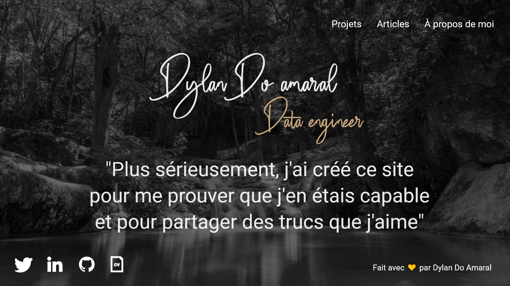
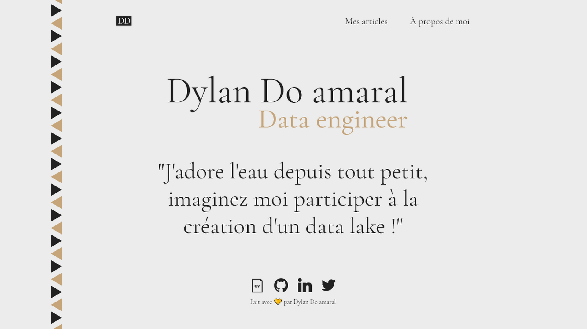

***On se sent fière quand on termine un objectif que l'on s'était fixé, en tout cas, c'est mon cas actuellement. Ce site est une petite victoire sur ma tendance à ne jamais être satisfait de par mon côté perfectionniste.***

Bon la vérité, c'est que ce n'est pas mon premier site internet, le premier c'est [celui-ci](http://astuce-invizimals.e-monsite.com/). Je pars du principe que le ridicule ne tue pas, j'avais 10 ans donc l'orthographe ce n'était pas trop ça (ça ne l'est toujours pas du coup, mais bon on remarque quand même une différence) mais c'était déjà ça. Ce qui est assez marrant, c'est que c'est le projet qui a le plus fonctionné de toute ma vie, à l'heure où j'écris ces lignes je suis le 129283ème visiteur! Je repars donc de plus bel avec un peu plus d'expérience tout de même et avec un peu plus de maturité, mais pas trop non plus.

#Pourquoi j'ai décidé de faire ce site

<aside-element>
    <callout-element type="d">Un petit conseil à tous ceux qui sont encore étudiants, il faut vraiment essayer de se créer un portfolio parce que rien de mieux que des preuves pour faire part de votre savoir-faire.</callout-element>
</aside-element>

La réponse courte : parce que j'en avais envie tout simplement, en soi n'y a pas vraiment de réponse longue. J'avais envie d'avoir un espace dans lequel je pourrais partager mes projets et autres. Quelque chose qui me représente vraiment et mon propre site était parfait pour cela. Cela me sert aussi de portfolio et renforce ma crédibilité, comme je les dis ci-dessus, un problème que j'ai, c'est mon incapacité à finir tout ce que j'entreprends, rien n'est jamais assez fini selon moi et j'en suis même venu à mettre des centaines d'heures de travails à la poubelle sur un coup de tête. Je touche vraiment à beaucoup de domaines de la programmation, mais comment en témoigner si je n'ai rien pour le prouver, c'est pour ça que ce site est né et que des articles vont suivre, je me considère comme un bricoleur numérique qui fait ses trucs dans son garage et surtout dans son coin. Il est temps pour moi de sortir un peu de ce garage !

J'en parlerai plus dans la prochaine partie, mais c'était vraiment important pour moi d'avoir un site fait par mes soins. Je ne dénigre pas les personnes utilisant Wordpress, Wix ou autres, mais ce n'était vraiment pas quelque chose qui me convenait. Avoir un site n'est pas une fierté en soi, mais le construire soi-même d'A à Z en est une pour moi. D'où cet article, car ce n'était pas tâche facile pour moi, notamment dût à l'abondant choix de technologies qui s'offrent à nous. On finit très vite par s'y perdre alors si en plus je peux aider certaines personnes, c'est parti.

Je voulais vraiment garder le contrôle et avec ce site, je fais ce que je veux, ici maintenant si je veux mettre un composant assez fancy et totalement personnalisé et bah c'est parti parce que je le peux.

<fancy-demonstration></fancy-demonstrationc>

Bon, c'est super simpliste comme exemple, mais ça m'a quand même pris deux petites heures. Au moins j'ai bien vérifié que je n'avais vraiment aucune limite et ça, c'est vraiment trop bien!

#Le choix des technologies

Ici, on passe aux choses sérieuses parce que l'univers du web est beaucoup trop large, c'est complètement fou ! Vous voulez un serveur ? Alors vous allez hésiter entre PHP, NodeJs, Python, Java. Un client un minimum haut niveau ? Alors vous allez forcément passer par le choix du starter que ce soit View Js, Reactjs ou angular. Une database pour stocker des données ? Je n'en parle même pas tellement le choix est extrêmement large. L'hébergeur aussi, OVH n'est pas forcément ce qu'il y a de mieux par rapport à votre problématique et des choix de technologies comme ceux-là, il y en a des centaines.

Je suis passé par ces choix et le fait est que dans mon cas, tout a évolué au cours du temps, il suffit par exemple de regarder le design du site pour comprendre que tout n'est pas apparu comme ça du jour au lendemain. Le résultat est dû à un long processus qui visait à recommencer encore et encore les mêmes choses, mais en utilisant des moyens différents afin d'arriver à quelque chose qui me convient.

<horizontal-element>
    

        
        <thumb-caption>Mon site à ses débuts</thumb-caption>
    

    

        
        <thumb-caption>Mon site actuellement</thumb-caption>
    

</horizontal-element>

Alors pour moi, qu'elle a été mon parcours pour enfin arriver à un résultat que je trouve satisfaisant. Je suis d'abord parti sans aucun framework du type React en utilisant juste web pack 4 pour bundler mes fichiers Javascript et utilisé les imports comme j'ai déjà pu le faire dans [ce projet](https://github.com/dylandoamaral/genetic-art). Mais voilà, on ne va pas se mentir, c'était assez contraignant d'avoir "que ça" alors j'ai commencé à rajouter SASS afin que me CSS soit plus plaisant à écrire et plus modulable. Puis ensuite, je ne voulais pas réécrire l'header à chaque fois alors j'ai utilisé un loader HTML pour pouvoir inclure des morceaux de codes dans une page HTML. Après avoir fait ça, on se demande pourquoi pas tout simplement utilisé la notion de composant que j'avais déjà vue avec React Native et c'est comme ça, de file en aiguille que j'en suis arrivé à utiliser Gatsby.

#Gatsby le magnifique

Toujours dans le but de faciliter la production, j'en suis donc arrivé à Gatsby et pour le coup, c'est vraiment super-cool. À ceux-ci se rajoutent des librairies en tous genres tels que [React-pose](https://popmotion.io/pose/) pour l'animation de mon liséré par exemple ou encore [Styled Components](https:/www.styled-componentscom/) qui me permet de désigner la quasi-totalité de mes composants en Javascript me permettant ainsi de stocker par exemple mes couleurs afin de pouvoir à tout moment changé ma couleur primaire qui est le #C6A57A si jamais j'en ai envie et ceux à la fois côté JS et côté CSS et puis il y a d'autres avantages comme facilités la création d'un thème si jamais je veux mon site en dark mode dans le futur (c'est prévu.).

<thumb-caption>Gatsby, essayer c'est vraiment l'adopter pour le coup !</thumb-caption>

<aside-element>
    
    <thumb-caption>Je ne suis vraiment pas payé pour le coup, mais voilà pour ceux qui veulent faire un premier site web pas trop complexe qui ne nécessite pas de serveur, foncé. <a href="https://www.gatsbyjs.org/">https://www.gatsbyjs.org/</a></thumb-caption>
</aside-element>

Alors je ne vais pas vous mentir que je ne sais même plus pourquoi je ne suis pas resté sur du React "basique". Je voulais tout de suite passer un cap parce que je savais pertinemment que cela aller être à faire tôt ou tard. Je n'avais jamais vraiment codé en React (seulement en React Native) et du coup j'ai un peu suivi le doc et deux solutions ont émergé, [Gatsby](https://www.gatsbyjs.org/) et [Next.js](https://nextjs.org/). Bon là encore, j'hésite comme la vingtième fois depuis le début et je tombe sur cet article : https:/dev.to/jameesy/gatsby-vs-next-js-what-why-and-when-4 al5. Il y avait une partie "when To use (Gatsby|Next.js)" j'ai juste opté pour celui qui me convenait le plus et adviendra qui pourra. Le fait est qu'il ne faut, des fois, pas trop se prendre la tête. C'est ce que j'ai fait, je voulais absolument commencer à développer mon site. Gatsby s'accompagne de GraphQL, c'est en gros ce qui va nous permettre de faire des queries directement dans notre fichier source pour remplacer la database qu'on est censé avoir. Il ne faut pas non plus oublier son system de plugins. A l'heure actuelle, grâce à ce dernier, j'ai juste à écrire un markdown et automatiquement l'article est généré. Bon, on ne va pas se mentir, si vous voyez l'état de mon markdown actuellement, c'est assez brouillon et il y a largement moyen de faire mieux.

Et le serveur dans tout ça ? Il n'y en a juste pas en fait, je n'en ai pas besoin en soit. Un site static me suffit largement et dans le pire des cas, je partirais certainement sur du Node.js/MongoDB ou alors peut être essayé symphonie même si je ne suis pas forcément ami avec le PHP... 

#Et maintenant ?

Et maintenant je vais faire des articles, je vais améliorer ce site, c'est un de mes nouveaux bébés alors je vais en prendre soin. Je tiens vraiment à dire que je ne compte pas faire d'articles user-friendly ici, si vous en voulez, j'en ai nottament écrits quelques uns (ici)[https://blog.univalence.io/author/dylan/]. Je parle de ce que je vis et comment je le ressens, ce n'est en rien des articles à vocation éducative, mais plus un Skyblog remplis de devlogs parce que'après tout, c'est mon petit jardin secret, il faut savoir s'amuser et c'est exactement ce que je suis en train de faire en développant ce site alors pourquoi s'arrêter en si bon chemin.

